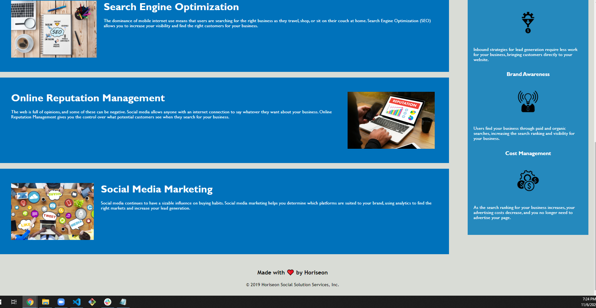

# **Horiseon**

A incredibly __informative__ web page that hits you like a blitzkrieg of knowledge about things you need to know to have a __successful online business__.

Following a K.I.S.S (Keep is simple stupid) format, Horiseon is able to deliver extremely __insightful snippets__ of information that will __grant you great success in the realm of online marketing__.

From topics of __Search Engine Optimization, Online Reputation Management, and Social Media Marketing to Lead Generation, Brand Awareness, and Cost Management__. You will leave thinking more about __posibilities of success__ rather than having stress of possible negative outcomes.

In this scary world of outside threats leading to a rise of online markets and businesses, __you'll need to stand out. 
Nothing stands out more than the sun on the Horiseon.__

Go to https://ponderhavok.github.io/ for the Full experience!
